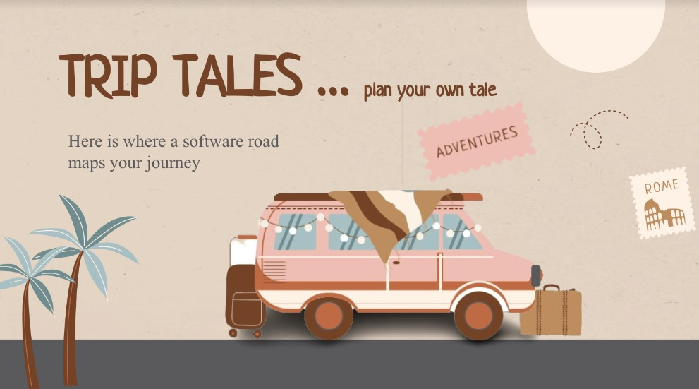
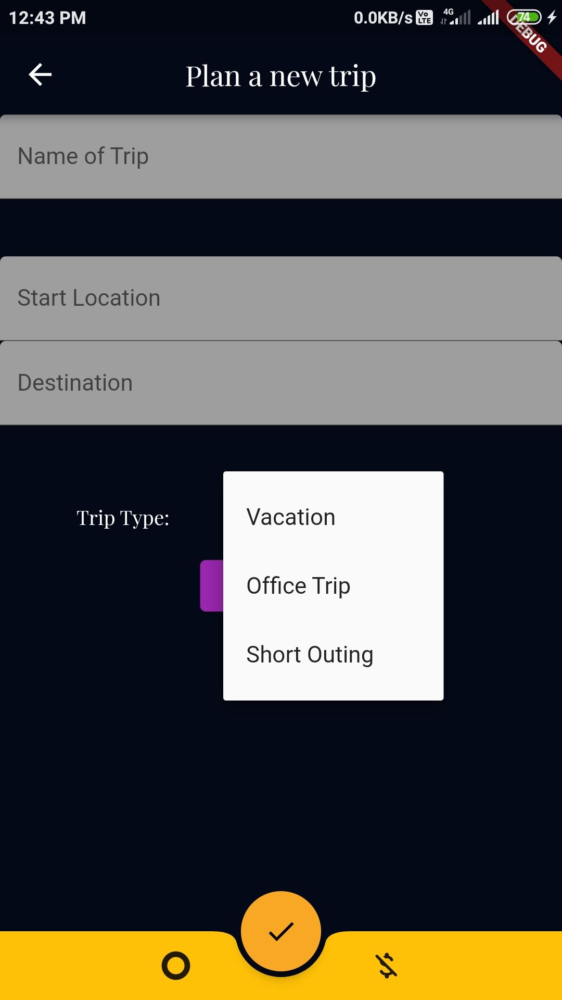

# TRIP TALES 
 
  

## module 1 - homepage/newtrip
- trip type and group formation (vacation, work, home)
- start date and end date
- availability of places, rooms and hotels and other source of tranportation
- user stops
- estimated travel costs (petrol prices, accomodation per person)
- food preferences (resturant recommendation)
- emergency contacts (vehicle breakdown, fuel station)
- allergies and health risks
- connect watch in journey

## module 2 - on the way
- enroute recommendations
	- food places
	- places to visit
- image accumulation and sorting
- weather alerts
- nearby connections
- vehicle and petrol status
- car sensor based accidents detection and alerts to the hospitals
- bad route alerts and optionals routes
- recommended driver switch (Dizzy driver alert)
- enroute critical news reports
- car temperature
- sorting the photos
- infotainment (songs)

## module 3 - expense tracker
- per person expenses/family expenses
- cost saving recommendations
- using data for future use and recommendations to other travellers

## module 4 - end of the journey
- video templates

## extras
- nearby room
- volunteer database of recommendations and details
- jiski car uski bhains
- using data to create a journey map for other people (Journey Map)
- washroom places (halka ho lo)

### problem statement

- AI based trip enhancement 
- alexa skills
- NLP for Indian languages 

## further improvements 
## vehicle breakdown and problems

- vehicle breakdown : connected vehicle; health of vehicle 
- fatigue of driver; intelligent cameras, alert when approaching 
- distraction from calls; not voice enabled cars; voice first experience
- infortainment system outdated; personalised in-cabin experience
- driving EV; anxious - no chargin points; battery trust : mobile app to plan the journey on vehicle usage and get POI advise optimal time usage 
- no updates for infortainment 
